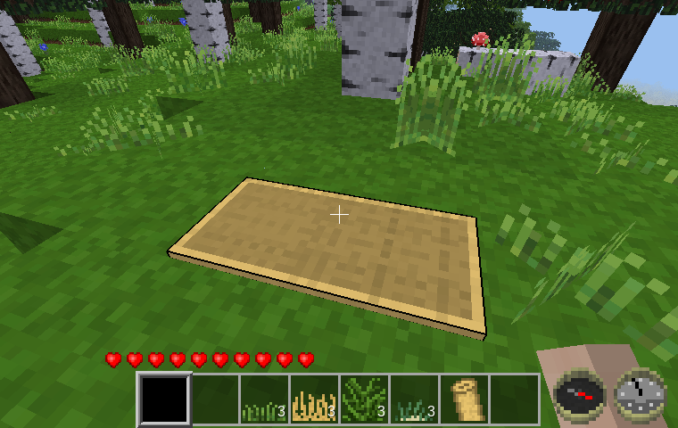

Sleeping Mat [sleeping_mat]
-------------------------

A simple sleeping mat made out of grass.

By David G (kestral246)

I was getting tired of having to go through the process of getting wool to make a bed, so I made a simpler to craft sleeping mat.

Note that sleeping on this mat will overwrite an existing bed respawn point, which will then get reset after destroying—i.e. picking up the sleeping mat (as of Jan 26, 2020 commit to mtg).

How to craft
------------
For crafting this sleeping mat, three grass nodes are required from three different types of grass—nine total grass nodes using any order (shapeless recipes).

Supported types are: grass, dry\_grass, jungle\_grass, and marram\_grass).

This means that players have to travel to several different biomes before they can build a sleeping mat.

Prior art
---------
After making this mod I discovered two alternatives.

- Napiophelios's campfire mod includes a sleeping mat (really a sleeping bag), but it requires wool—just what I was trying to avoid.
- Duane's fun_tools mod includes a nest, but it's too easy to make—just four leaves or needles of the same type.

Licenses
--------
Source code

> The MIT License (MIT)

Media (textures)

> Attribution-ShareAlike 3.0 Unported (CC BY-SA 3.0)

